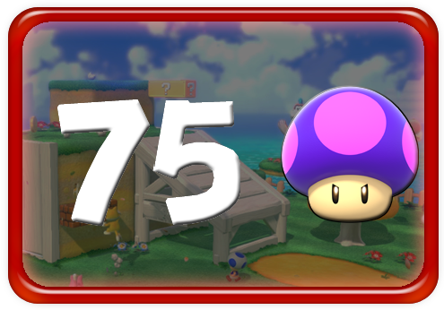

# Death Counter Generator

Hi, [I make Let's Plays](https://www.youtube.com/user/2andaHalfStooges/videos). Sometimes I like to have a little card pop up in the corner of the screen every time I die in a game, and sometimes I die in games often enough that creating them manually is impractical. To which the obvious solution to is automation!

### Credits

 - icon: Death by Blair Adams from the Noun Project
 - The user interface is made using a [library for GameMaker that I wrote a while ago](https://dragonite.itch.io/emu-ui-for-gamemaker). You all should totally go check it out.